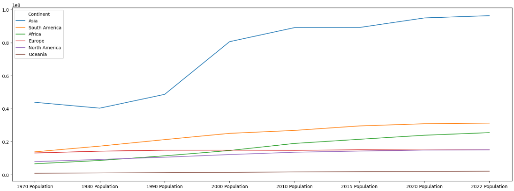
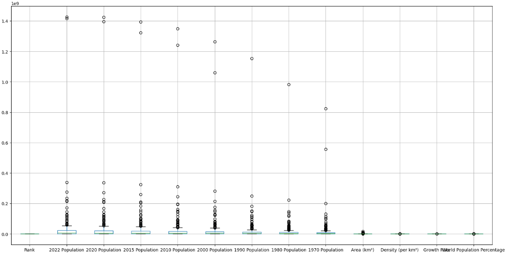

# Pandas World Population Exploratory Data Analysis
In this project we used pandas to analyse patterns in world population data.

## Quick Links
- World population dataset: [World Population Dataset](world_population.csv)
- Jupyter notebook of exploratory data analysis of the world population dataset. [Jupyter Notebook](world_population_data_exploration_project.ipynb)
- Other projects I have made: [Portfolio Website](https://lucashoffschmidt.github.io/)

## Technologies Used
- **Jupyter Notebook**: Web-based interactive computing environment. 
- **Pandas**: Dataset interaction and transformations. 
- **Matplotlib**: Data visualizations and formatting. 
- **Seaborn**: Statistical data visualizations. 

## Project Objective
- Analyse patterns in the world population over the last 50 years to determine the growth rate of the world population. 

## Data Source
- [World Population](world_population.csv)

## Process
- Created a new Jupyter Notebook. 
- Imported pandas, seaborn and matplotlib.pyplot.
- Transformed the world population .csv dataset to a dataframe using read_csv().
- Formatted each number to two decimal places using set_option().
- Showed columns non-null count and data type using info().
- Showed statistical elements for each column using describe().
- Showed null values for each column using isnull().sum().
- Showed number of unique values for each column using nunique().
- Showed only numeric columns using select_dtypes().
- Showed the top and bottom 10 values for the column 2022 population using sort_values().head().
- Showed the countries with the highest world population percentages by using sort_values().head().
- Showed the numerical correlation between columns using select_dtypes() and corr().
- Showed the visual and numerical correlation between columns using heatmap(), title(), rcParams[] and show().
- Showed the mean of each continent, sorted by the 2022 population descendingly using groupby().mean().sort_values().
- Showed all countries in Oceania using str.contains().
- Showed list of all column names using columns.
- Made a new dataframe df2 showing the mean of each continent, sorted by the 2022 population descendingly and only including population data using groupby(), columns, mean() and sort_values.
- Transposed the axes of df2 to show continents in the columns and populations in the rows using transpose().
- Showed a line plot of the growth of continents using plot().
- Showed outliers using boxplot().

## Key findings
- The Vatican City is the smallest country.
- Population density varies widely, so in some countries people live very close together, while in others they live very far apart.
- All continents populations have increased linearly, except for Europa, which population has decreased and Asia, which exhibited explosive population growth in the 1990s, followed by a linear growth.
- China and India are by far the greatest contributors to the growth in Asia with almost 3 billion people between them in 2022. 

## Visualizations
**Heat map of the correlation between columns**

**Line plot of the growth of continents over time**

**Boxplot of outliers across columns**

## Conclusion
All continents' populations seem to be growing linearly, except for Europe which has a decreasing population and Asia which had an explosive population growth in the 1990s and is now growing linearly.
The greatest contributors to the population growth worldwide is by far China and India with almost 3 billion people between them in 2022. 
