# Pandas World Population Exploratory Data Analysis
In this project we used pandas to analyse patterns in world population data over the last 50 years.

## Quick Links
- World population dataset: [World Population Dataset](world_population.csv)
- Jupyter notebook of exploratory data analysis of the world population dataset. [Jupyter Notebook](world_population_data_exploration_project.ipynb)
- Other projects I have made: [Portfolio Website](https://lucashoffschmidt.github.io/)

## Technologies Used
- **Jupyter Notebook**: Web-based interactive computing environment. 
- **Pandas**: Dataset interaction and transformations. 
- **Matplotlib**: Data visualizations and formatting. 
- **Seaborn**: Statistical data visualizations. 

## Process
- Created a new Jupyter Notebook and imported pandas, seaborn and matplotlib.pyplot.
- Loaded the world population dataset into a dataframe
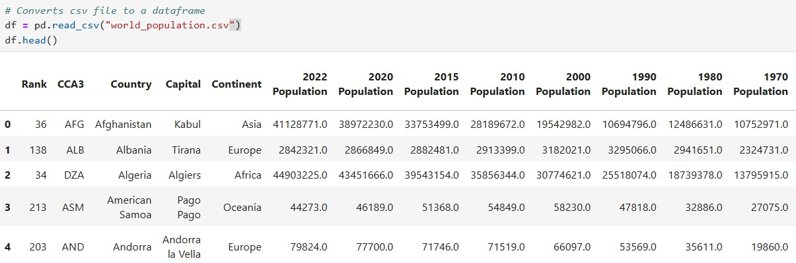

- Formatted each number to two decimal places using set_option().

- Checked nulls and data types of columns
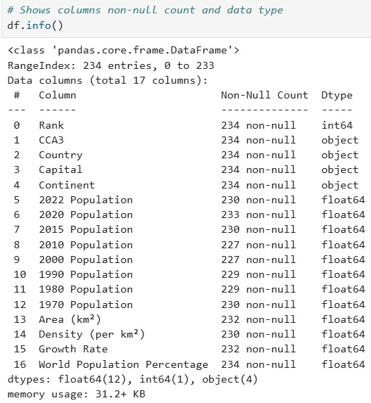

- Got an overview of the statistical distribution of the numerical columns of the dataframe
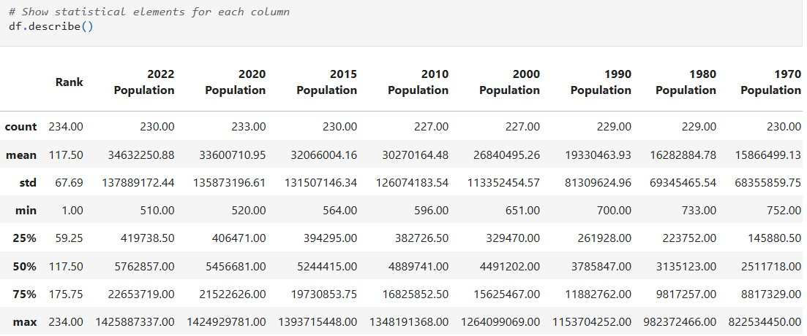

- Inspected count of nulls for each column
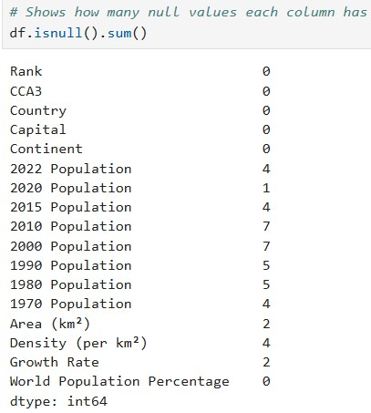

- Found number of unique values for each column
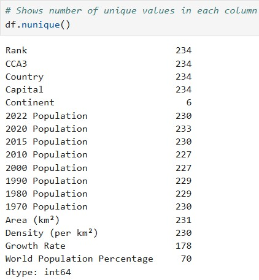

- Got an overview of the columns in the dataset
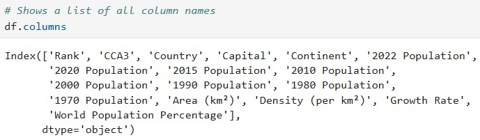

- Filtered numerical columns
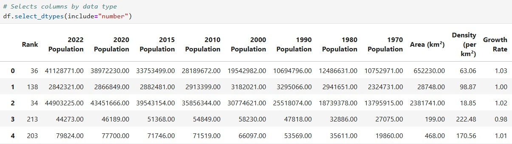

- Showed top 10 lowest populations in 2022
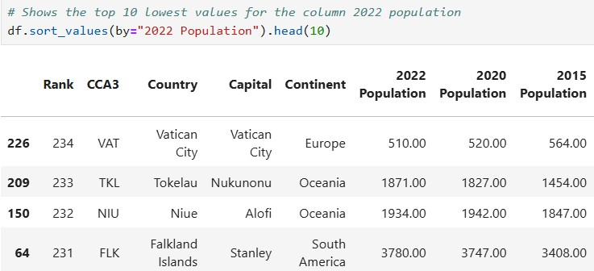

- Showed top 10 highest populations in 2022
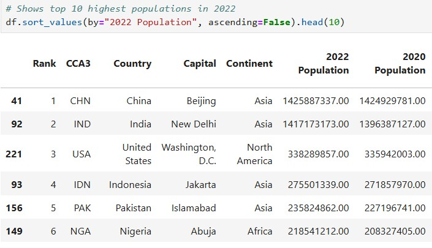

- Made an overview of the correlation between numerical columns

- Created a heatmap of the correlation between numerical columns
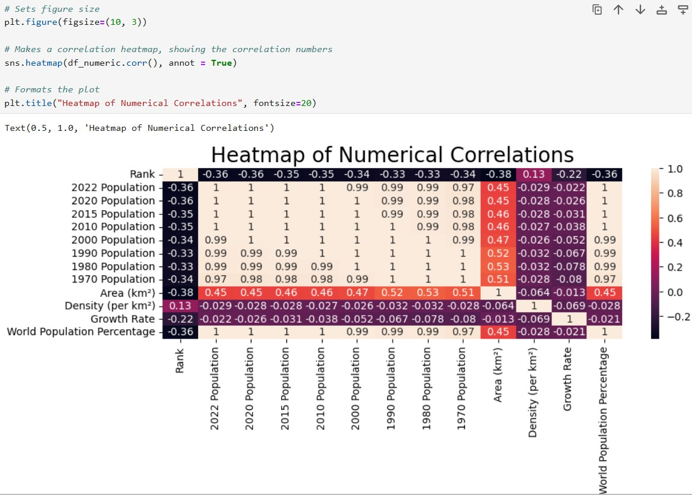

- Showed the mean of each continent, sorted descendingly by the population in 2022
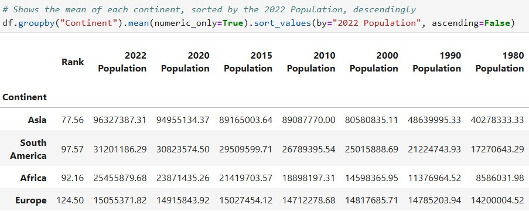

- Listed all countries in Oceania
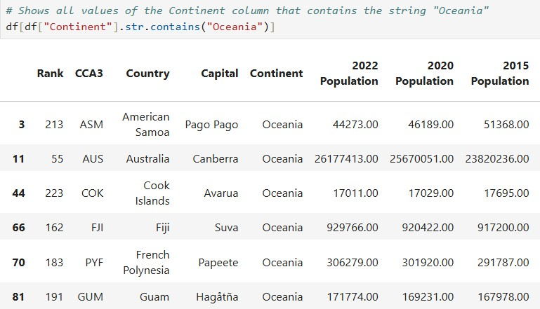

- Calculated the mean of each continent, sorted by the 2022 population descendingly, and only including population data
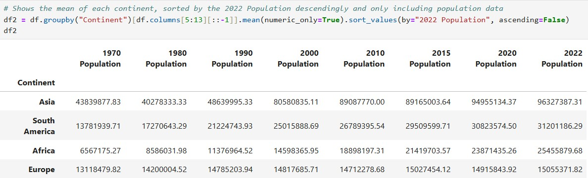

- Transposed dataframe to have continents for columns and populations for rows
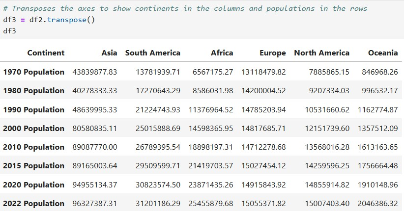

- Created a lineplot of population growth over time by continent
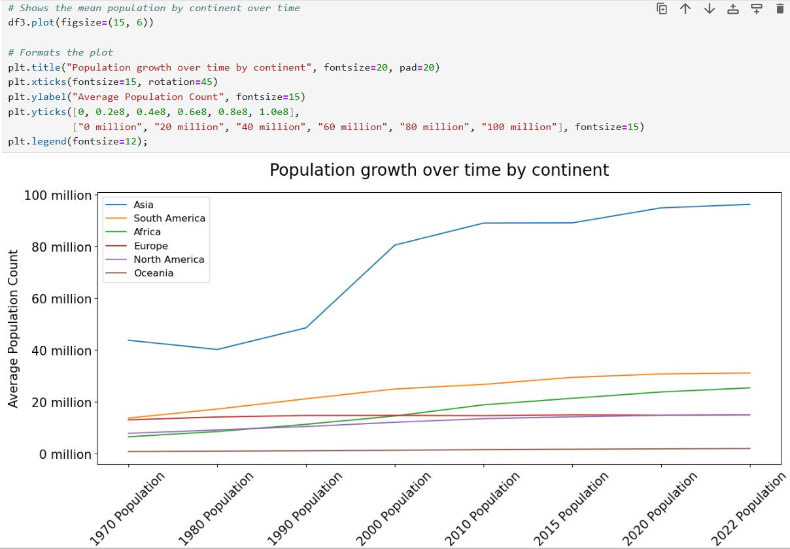

- Created a boxplot of Distribution of population count by year
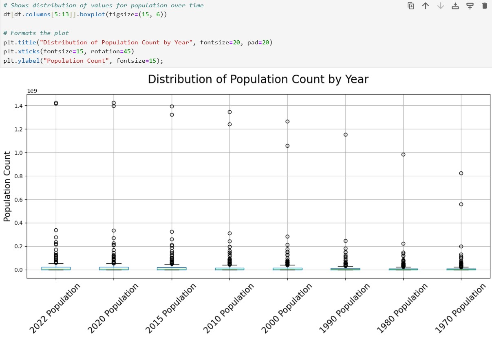

## Key findings
- The Vatican City is the smallest country.
- Population density varies widely by country.
- All continents populations have increased linearly, except for Europe, whose population has decreased and Asia, which exhibited explosive population growth in the 1990s, followed by linear growth.
- China and India are by far the greatest contributors to the growth in Asia, with almost 3 billion people between them in 2022. 
