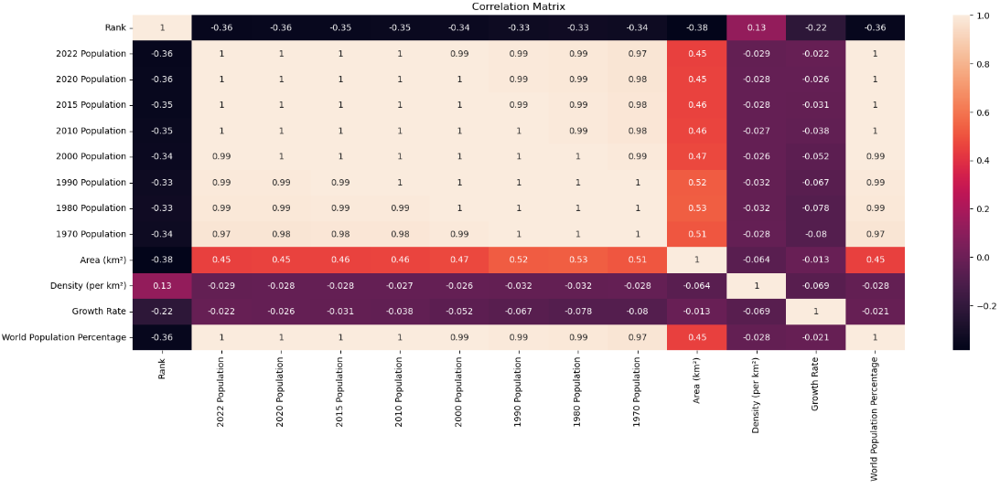

# Python Pandas World Population Exploratory Data Analysis
In this project we used python in Jupyter Notebook to analyse patterns in world population data.

## Tools and technologies
- **Jupyter Notebook**
- **Python**:
  - Pandas
  - Seaborn
  - Matplotlib.pyplot

## Project Objectives
- Analyse patterns in the world population over the last 50 years

## Data Sources
- [World Population](world_population.csv)

## Analysis steps
- **Data Exploration**:
  - Imported pandas, seaborn and matplotlib.pyplot
  - Transformed the world population csv file to a dataframe using read_csv()
  - Formatted each number to two decimal places using set_option()
  - Showed columns non-null count and data type using info()
  - Showed statistical elements for each column using describe()
  - Showed null values for each column using isnull().sum()
  - Showed number of unique values for each column using nunique()
  - Showed only numeric columns using select_dtypes()
  - Showed the top and bottom 10 values for the column 2022 population using sort_values().head()
  - Showed the countries with the highest world population percentages by using sort_values().head()
  - Showed the numerical correlation between columns using select_dtypes() and corr()
  - Showed the visual and numerical correlation between columns using heatmap(), title(), rcParams[] and show()
  - Showed the mean of each continent, sorted by the 2022 population descendingly using groupby().mean().sort_values()
  - Showed all countries in Oceania using str.contains()
  - Showed list of all column names using columns
  - Made a new dataframe df2 showing the mean of each continent, sorted by the 2022 population descendingly and only including population data using groupby(), columns, mean() and sort_values
  - Transpose the axes of df2 to show continents in the columns and populations in the rows using transpose()
  - Showed a line plot of the growth of continents using plot()
  - Showed outliers using boxplot()

## Key findings
- The Vatican City is the smallest country
- Population density varies widely, so in some countries people live very close together, while in others they live very far apart
- All continents populations have grown incrementally, except for Asia, which has exhibited explosive population growth

## Visualizations
**Heat map of the correlation between columns**

**Line plot of the growth of continents over time**

**Boxplot of outliers across columns**

## Conclusion
There is a big difference in population growth and density between Asia and the rest of the world. 
